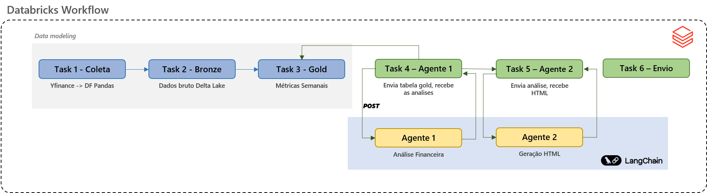

# Agentes de IA com Databricks e LangChain

Construa uma pipeline completa de inteligência financeira com agentes de IA, do zero à entrega automatizada.




## Descrição

Neste projeto você vai construir do zero um sistema que coleta dados de Bitcoin, processa e armazena no Delta Lake, aciona dois agentes de IA e entrega um report semanal de análise financeira por e-mail, tudo orquestrado pelo Databricks Workflow.

O foco é prático: cada etapa termina com código funcionando e uma parte do pipeline concluída. Ao final você terá um produto real, replicável para outros ativos financeiros e contextos de negócio.


## Carga Horária

10 aulas de até 20 minutos, totalizando aproximadamente 3 horas de conteúdo.


## Blocos de Conhecimento

**Bloco 1 — Modelagem dos Dados**
Configuração do ambiente Databricks, coleta de dados via Yahoo Finance e construção das camadas bronze e gold no Delta Lake com métricas analíticas semanais de BTC.

**Bloco 2 — Construção dos Agentes**
Criação do Agente 1 para análise financeira comparativa e do Agente 2 para geração do report em HTML, utilizando LangGraph com prompts versionados em arquivo.

**Bloco 3 — Orquestração do Fluxo**
Montagem do Databricks Workflow conectando todas as etapas, integração com Resend para envio de e-mail, execução completa do pipeline e agendamento semanal automatizado.


## Stack do Projeto

| Tecnologia | Uso |
|---|---|
| Python | Linguagem base de todo o projeto |
| Databricks | Plataforma principal e agendamento do Workflow |
| Delta Lake | Armazenamento em camadas bronze e gold |
| LangGraph | Construção e orquestração dos agentes |
| LangSmith | Rastreamento e monitoramento das chamadas |
| yfinance | Coleta de dados do Yahoo Finance |
| Pandas | Transformação e cálculo das métricas semanais |
| Gemini | Modelo de linguagem utilizado nos agentes |
| Resend | Envio do report por e-mail |


## Estrutura do Projeto

```
bitcoin-analytics-agent/
    ├── prompts/
    │   ├── agente_analise.txt
    │   └── agente_html.txt
    ├── 01_setup.sql
    ├── 02_etl_camada_bruta.py
    ├── 03_etl_camada_refinada.py
    ├── 04_agente_analise_financeira.py
    ├── 05_agente_construcao_email.py
    ├── 06_stack_envio_email.py
    ├── .env
    └── .gitignore
```


## Variáveis de Ambiente

Crie um arquivo `.env` na raiz do projeto com as seguintes variáveis:

```
LANGCHAIN_API_KEY=sua-chave-langsmith
LANGCHAIN_TRACING_V2=true
LANGCHAIN_PROJECT=btc-analytics
GOOGLE_API_KEY=sua-chave-gemini
RESEND_API_KEY=sua-chave-resend
EMAIL_DESTINO=destinatario@email.com
```


## Aviso

Este projeto é de caráter educacional. As análises geradas pelos agentes de IA não constituem recomendação de investimento.